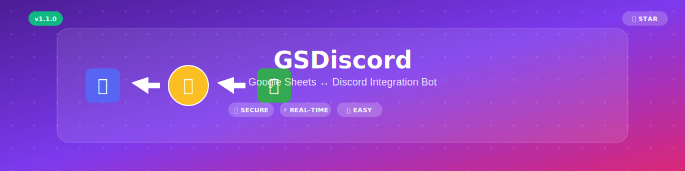
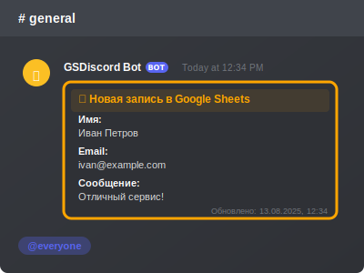
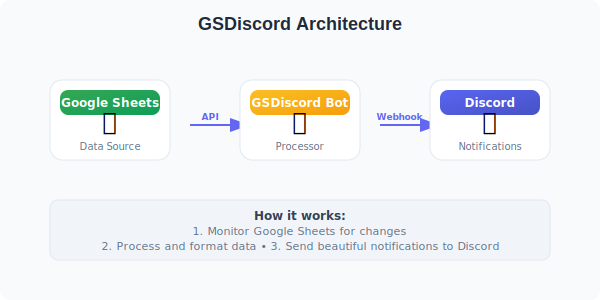

# 🤖 GSDiscord Bot

<div align="center">



[](https://nodejs.org/)
[](LICENSE)
[](https://discord.com/)
[](https://developers.google.com/sheets/api)

[](https://github.com/IZenApp/GSDiscord/stargazers)
[](https://github.com/IZenApp/GSDiscord/issues)
[](https://github.com/IZenApp/GSDiscord/network)

</div>

**GSDiscord** - это современный бот для интеграции Google Sheets с Discord. Автоматически отслеживает изменения в ваших Google таблицах и отправляет красивые уведомления в Discord каналы.

## 🌟 Особенности

- 🔄 **Автоматический мониторинг** Google Sheets в реальном времени
- 💬 **Красивые embed сообщения** в Discord
- 📝 **Подробное логирование** всех операций  
- 🛡️ **Безопасное хранение** учетных данных
- ⚙️ **Гибкая конфигурация** через переменные окружения
- 🚀 **Простая установка и настройка**
- 📊 **Поддержка различных форматов данных**

## 📋 Требования

- **Node.js** версии 14.x или выше
- **npm** (поставляется с Node.js)
- **Google Cloud Project** с включенным Google Sheets API
- **Discord сервер** с правами на создание вебхуков

## 🚀 Быстрый старт

### 1. Клонирование репозитория

```bash
git clone https://github.com/IZenApp/GSDiscord.git
cd GSDiscord
```

### 2. Установка зависимостей

```bash
npm install
```

### 3. Первоначальная настройка

```bash
npm run setup
```

Скрипт установки поможет вам:
- Создать файл `.env` с необходимыми переменными
- Создать пример файла учетных данных Google
- Настроить базовую конфигурацию

### 4. Настройка Google Sheets API

1. Перейдите в [Google Cloud Console](https://console.cloud.google.com/)
2. Создайте новый проект или выберите существующий
3. Включите **Google Sheets API**
4. Создайте **Service Account** и скачайте JSON файл с ключами
5. Поместите файл в `credentials/google-credentials.json`

### 5. Настройка Discord Webhook

1. Откройте настройки канала в Discord
2. Перейдите в раздел **Интеграции** → **Вебхуки**
3. Создайте новый вебхук и скопируйте URL
4. Добавьте URL в файл `.env`

### 6. Проверка безопасности

```bash
npm run security
```

### 7. Проверка конфигурации

```bash
npm run validate
```

### 8. Запуск бота

```bash
npm start
```

Для разработки с автоматической перезагрузкой:

```bash
npm run dev
```

## ⚙️ Конфигурация

### Переменные окружения (.env)

```env
# Google Sheets Configuration
GOOGLE_SHEET_ID=your_google_sheet_id_here

# Discord Configuration  
DISCORD_WEBHOOK_URL=your_discord_webhook_url_here

# Application Configuration
LOG_LEVEL=info
```

### Структура проекта

```
GSDiscord/
├── 📁 src/                    # Исходный код
│   ├── 📁 config/            # Конфигурация
│   │   └── config.js         # Основная конфигурация
│   ├── 📁 services/          # Бизнес-логика
│   │   ├── GoogleSheetsService.js
│   │   └── DiscordService.js
│   ├── 📁 utils/             # Утилиты
│   │   └── logger.js         # Система логирования
│   └── index.js              # Точка входа
├── 📁 scripts/               # Служебные скрипты
│   ├── setup.js              # Настройка проекта
│   └── validate.js           # Проверка конфигурации
├── 📁 credentials/           # Учетные данные (в .gitignore)
├── 📁 logs/                  # Файлы логов (в .gitignore)
├── 📁 docs/                  # Документация
├── 📁 assets/                # Изображения и ресурсы
├── .env                      # Переменные окружения (в .gitignore)
├── .gitignore               # Игнорируемые файлы
├── package.json             # Зависимости и скрипты
└── README.md               # Этот файл
```

### 💬 Результат в Discord

<div align="center">



*Пример уведомления в Discord канале*

</div>

## � Безопасность

### ⚠️ ВАЖНО: Защита конфиденциальных данных

Проект настроен для максимальной защиты ваших личных данных:

- 🔒 **Автоматическая проверка секретов** - `npm run security`
- 🛡️ **Расширенный .gitignore** - защищает от случайных коммитов
- 📁 **Изолированное хранение** учетных данных в `credentials/`
- 🔑 **Переменные окружения** вместо захардкоженных значений

### Файлы, которые НИКОГДА не попадут в Git:
- `.env` (ваши секреты)
- `credentials/` (Google Service Account)
- `logs/` (могут содержать чувствительную информацию)
- Любые файлы с токенами, паролями, API ключами

**📚 Подробнее:** [docs/SECURITY.md](docs/SECURITY.md)

---

## �🔧 Доступные команды

```bash
npm start           # Запуск бота в продакшн режиме
npm run dev         # Запуск в режиме разработки с автоперезагрузкой
npm run setup       # Первоначальная настройка проекта
npm run google-setup # Инструкции по настройке Google Cloud
npm run validate    # Проверка конфигурации
npm run security    # Проверка безопасности проекта
npm run precommit   # Полная проверка перед коммитом
npm run clean       # Очистка логов
npm test           # Запуск тестов (в разработке)
```

## 📊 Как это работает

<div align="center">



</div>

1. **Мониторинг**: Бот периодически (каждые 10 секунд) проверяет Google Sheets на наличие изменений
2. **Обнаружение**: При обнаружении новых данных бот получает последнюю добавленную строку
3. **Форматирование**: Данные форматируются в красивое embed сообщение
4. **Отправка**: Сообщение отправляется в указанный Discord канал через webhook
5. **Логирование**: Все действия записываются в лог файлы для отладки

## 🛠️ Кастомизация

### Изменение интервала проверки

В файле `src/config/config.js`:

```javascript
app: {
  checkInterval: 10000, // в миллисекундах (10 секунд)
}
```

### Настройка диапазона данных

```javascript
google: {
  range: 'Sheet1!C2:F' // Измените диапазон по необходимости
}
```

### Кастомизация Discord сообщений

В файле `src/services/DiscordService.js` можно изменить:
- Цвет embed сообщений
- Формат отображения данных
- Дополнительные поля

## 🔍 Отладка

### Просмотр логов

```bash
# Просмотр логов текущего дня
cat logs/$(date +%Y-%m-%d).log

# Отслеживание логов в реальном времени
tail -f logs/$(date +%Y-%m-%d).log
```

### Типичные проблемы

1. **"Ошибка аутентификации Google"**
   - Проверьте правильность файла учетных данных
   - Убедитесь, что Google Sheets API включен

2. **"Ошибка Discord webhook"**
   - Проверьте корректность URL webhook
   - Убедитесь, что бот имеет права на отправку сообщений

3. **"Sheet ID не найден"**
   - Проверьте правильность ID таблицы в конфигурации
   - Убедитесь, что сервисный аккаунт имеет доступ к таблице

## 🤝 Вклад в проект

Любые вклады **очень ценятся**! Прочитайте [CONTRIBUTING.md](CONTRIBUTING.md) для подробной информации о том, как участвовать в развитии проекта.

1. Fork проект
2. Создайте ветку для новой функции (`git checkout -b feature/amazing-feature`)
3. Зафиксируйте изменения (`git commit -m 'Add amazing feature'`)
4. Отправьте в ветку (`git push origin feature/amazing-feature`)
5. Откройте Pull Request

## ⭐ Поддержка проекта

Если проект вам помог, поставьте ⭐ звездочку на GitHub!

<div align="center">

### 📊 Статистика проекта


</div>

## 📄 Лицензия

Этот проект лицензирован под MIT License - см. файл [LICENSE](LICENSE) для деталей.

## 👥 Авторы

- **IZenApp** - *Основной разработчик* - [GitHub](https://github.com/IZenApp)

Полный список [участников](https://github.com/IZenApp/GSDiscord/contributors) проекта.

## 🙏 Благодарности

- [Google](https://developers.google.com/sheets/api) за предоставление API для работы с Sheets
- [Discord](https://discord.com/developers/docs/intro) за удобный API для интеграций
- [Node.js](https://nodejs.org/) сообществу за отличные библиотеки
- Всем [участникам](https://github.com/IZenApp/GSDiscord/contributors) проекта

---

<div align="center">

**⭐ Если проект был полезен, поставьте звездочку! ⭐**

[🚀 Начать использовать](docs/QUICKSTART.md) • [📖 Документация](docs/INSTALLATION.md) • [🐛 Сообщить об ошибке](https://github.com/IZenApp/GSDiscord/issues) • [💡 Предложить функцию](https://github.com/IZenApp/GSDiscord/issues)

</div>
